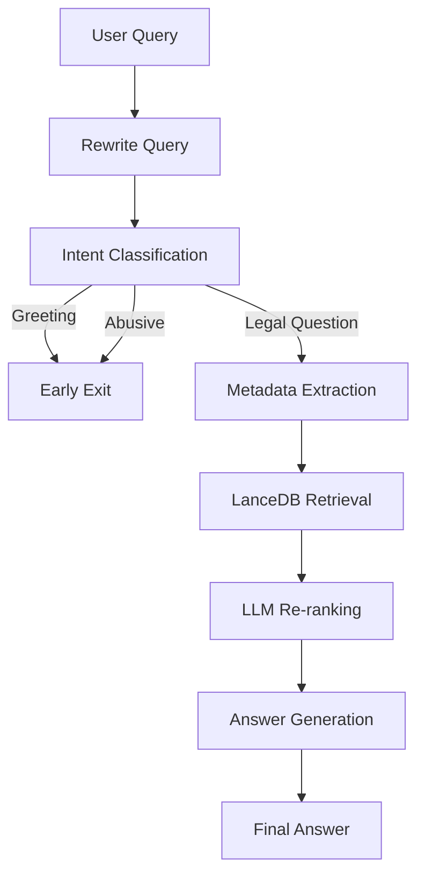

<div align="center">

# ⚖️ Agentic Persian Legal RAG

### Intelligent Legal Question Answering System for Iranian Laws using Agentic Retrieval-Augmented Generation

<p align="center">


</p>

<p align="center">
An intelligent Persian legal assistant that combines Agentic RAG, semantic retrieval, metadata-aware search, and LLM reranking to answer questions about Iranian laws.
</p>

</div>

---

# 📌 Overview

Large Language Models often struggle with legal reasoning due to outdated knowledge, hallucinations, and the inability to access domain-specific legal documents.

This project introduces an **Agentic Retrieval-Augmented Generation (RAG)** architecture designed specifically for answering questions about Iranian laws.

Instead of relying on a single retrieval step, the system decomposes the problem into multiple reasoning stages:

- Query Rewriting
- Intent Classification
- Metadata Extraction
- Semantic Retrieval
- LLM-Based Re-ranking
- Grounded Answer Generation

The result is a more accurate, explainable, and reliable legal question-answering system.

---

# 🎯 Objectives

The primary goals of this project are:

- Improve legal document retrieval accuracy
- Reduce hallucinations in legal responses
- Increase answer grounding through document citations
- Leverage metadata-aware filtering
- Evaluate latency and bottlenecks of Agentic RAG systems

---

# 🏗️ System Architecture

<p align="center">

</p>

The workflow consists of multiple LangGraph nodes:

```text
User Query
     │
     ▼
Query Rewriter
     │
     ▼
Intent Classifier
     │
     ├── Greeting
     ├── Abusive
     └── Legal Question
              │
              ▼
Metadata Extraction
              │
              ▼
Semantic Retrieval
              │
              ▼
LLM Re-ranking
              │
              ▼
Answer Generation
              │
              ▼
Final Response
```

---

# ⚙️ Agent Workflow



---

# 🔍 Query Rewriting

User queries are first rewritten using GPT-4o-mini to generate a retrieval-friendly version.

Example:

### Original Query

```text
کارفرما چه زمانی می‌تواند قرارداد کار را فسخ کند؟
```

### Rewritten Query

```text
شرایط قانونی فسخ قرارداد کار توسط کارفرما طبق قانون کار جمهوری اسلامی ایران چیست؟
```

Benefits:

- Better semantic matching
- Improved recall
- Reduced ambiguity

---

# 🧠 Intent Classification

The system categorizes incoming requests into:

| Intent | Description |
|----------|------------|
| greeting | Greetings and casual conversation |
| abusive | Offensive or abusive content |
| law_question | Legal questions |

Non-legal requests are handled through early routing to reduce unnecessary computation.

---

# 🏷 Metadata Extraction

Legal metadata is automatically extracted before retrieval.

Extracted fields include:

```json
{
  "legal_domain": "labor_law",
  "section_number": 27,
  "keywords": [
    "employment",
    "termination",
    "contract"
  ]
}
```

This information is later used for metadata-aware filtering inside LanceDB.

---

# 📚 Semantic Retrieval

Document retrieval is performed using:

### Embedding Model

```python
intfloat/multilingual-e5-large
```

The model generates dense representations for Persian legal queries and documents.

Retrieved documents are stored in:

```python
LanceDB
```

which provides fast vector search and metadata filtering.

---

# 🎯 LLM-Based Re-ranking

After retrieval, candidate documents are scored using GPT-4o-mini.

Each retrieved document receives a relevance score:

```text
0.0 → Irrelevant
1.0 → Highly Relevant
```

The top-ranked documents are selected for final answer generation.

Advantages:

- Improved precision
- Better context selection
- Reduced irrelevant evidence

---

# ✨ Grounded Answer Generation

The final response is generated exclusively from retrieved legal documents.

The model is instructed to:

- Answer in Persian
- Cite legal articles
- Avoid unsupported claims
- Use retrieved evidence only

This significantly reduces hallucination risk.

---

# 📊 Performance Analysis

The execution time of every node is recorded during inference.

## Average Node Execution Time

| Node | Average Time (s) |
|--------|--------|
| Rewrite Query | 0.80 |
| Intent Classification | 0.72 |
| Metadata Extraction | 1.03 |
| Context Retrieval | 0.17 |
| Re-ranking | 5.01 |
| Answer Generation | 2.84 |

---

## Latency Visualization

<p align="center">

</p>

### Key Findings

- Re-ranking is the largest bottleneck.
- Retrieval latency is negligible.
- Most execution time is spent on LLM calls.
- Re-ranking consumes over 50% of total pipeline runtime.

---

# 🧪 Example Interaction

### User

```text
کارفرما در چه شرایطی می‌تواند قرارداد کار را فسخ کند؟
```

### System

```text
مطابق ماده ... قانون کار جمهوری اسلامی ایران ...

...
```

### Sources

```text
قانون کار - ماده 27
قانون کار - ماده 21
```

---

# 📁 Project Structure

```text
Agentic-Persian-Legal-RAG
│
├── app.py
│
├── lancedbv2/
│   └── vector database
│
├── data/
│   └── legal documents
│
├── notebooks/
│   └── experiments
│
├── evaluation/
│   ├── timing_analysis.csv
│   └── evaluation_results.xlsx
│
├── figures/
│   ├── architecture.png
│   └── timing_analysis.png
│
└── README.md
```

---

# 🚀 Installation

## Clone Repository

```bash
git clone https://github.com/YOUR_USERNAME/Agentic-Persian-Legal-RAG.git

cd Agentic-Persian-Legal-RAG
```

## Create Environment

```bash
conda create -n legal-rag python=3.10

conda activate legal-rag
```

## Install Dependencies

```bash
pip install -r requirements.txt
```

---

# 🔑 Environment Variables

Create a `.env` file:

```env
OPENAI_API_KEY=YOUR_OPENAI_API_KEY
```

---

# ▶ Running the Application

```bash
chainlit run app.py -w --port 8000
```

Open:

```text
http://localhost:8000
```

---

# 💻 Technologies Used

| Category | Technology |
|-----------|------------|
| Agent Framework | LangGraph |
| LLM | GPT-4o-mini |
| Embeddings | multilingual-e5-large |
| Vector Database | LanceDB |
| Interface | Chainlit |
| Workflow Engine | StateGraph |
| Language | Python |

---

# 📈 Future Improvements

### Retrieval

- Hybrid Retrieval (BM25 + Dense Retrieval)
- Multi-Vector Retrieval
- Query Expansion

### Re-ranking

- Cross Encoder Rerankers
- Cohere Rerank
- BGE Reranker

### Generation

- Citation Verification
- Hallucination Detection
- Legal Reasoning Chains

### Infrastructure

- Streaming Responses
- Async Graph Execution
- Distributed Retrieval

---

# 🤝 Contributing

Contributions are welcome.

Feel free to:

- Open Issues
- Submit Pull Requests
- Suggest Improvements
- Report Bugs

---

# 📜 License

This project is licensed under the MIT License.

---

# 👨‍💻 Author

### Farzad Jannati

M.Sc. Student in Information Technology

University of Tehran

---

# ⭐ Support

If you find this project useful, consider giving it a star ⭐
