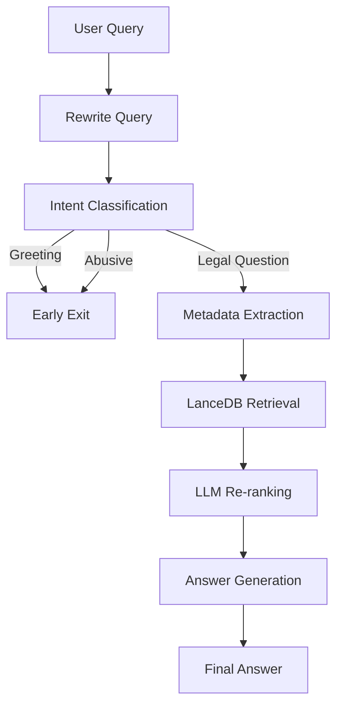
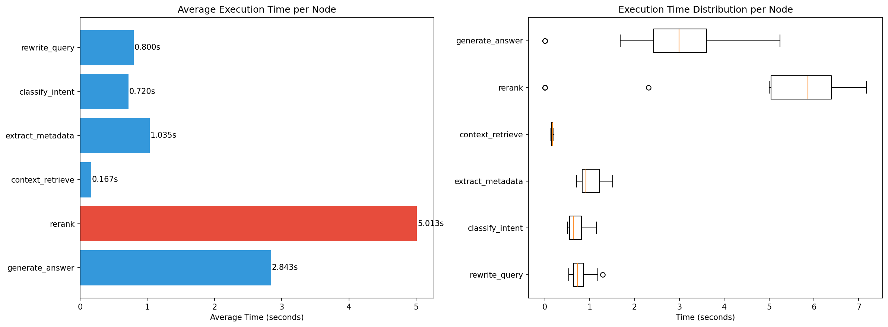

<div align="center">


</div>

---

# Intelligent Legal Question Answering System for Iranian Laws using Agentic Retrieval-Augmented Generation (RAG)

The project demonstrates how multi-stage agent workflows can significantly improve retrieval quality, answer grounding, and legal reasoning while maintaining transparency through execution-time monitoring and performance analysis.

<div align="left">

[](https://www.python.org/)
[](https://www.langchain.com/langgraph)
[](https://lancedb.github.io/lancedb/)
[](https://openai.com/)
[](https://huggingface.co/intfloat/multilingual-e5-large)
[](https://docs.chainlit.io/)
[](https://github.com/farzadjannati/Agentic-Persian-Legal-RAG)
[](https://opensource.org/licenses/MIT)

</div>

## Abstract

Legal question answering remains one of the most challenging applications of Large Language Models due to domain-specific terminology, strict factual requirements, and the high cost of hallucinations.

This project introduces an Agentic RAG framework specifically designed for Iranian legal documents. Unlike traditional single-stage retrieval pipelines, the proposed system decomposes the reasoning process into multiple specialized agents, including query rewriting, intent classification, metadata extraction, semantic retrieval, reranking, and answer generation.

By combining dense retrieval through multilingual E5 embeddings, metadata-aware filtering in LanceDB, and GPT-4o-mini-based reranking and generation, the framework provides more accurate, grounded, and explainable responses. Furthermore, execution-time profiling enables detailed latency analysis and identification of computational bottlenecks within the pipeline.

## Table of Contents

1. [Overview](#overview)
2. [Objectives](#objectives)
3. [Agent Workflow](#agent-workflow)
4. [Query Rewriting](#query-rewriting)
5. [Intent Classification](#intent-classification)
6. [Metadata Extraction](#metadata-extraction)
7. [Semantic Retrieval](#semantic-retrieval)
8. [LLM-Based Re-ranking](#llm-based-re-ranking)
9. [Grounded Answer Generation](#grounded-answer-generation)
10. [Performance Analysis](#performance-analysis)
11. [Example Interaction](#example-interaction)
12. [Project Structure](#project-structure)
13. [Installation](#installation)
14. [Environment Variables](#environment-variables)
15. [Running the Application](#running-the-application)
16. [Future Improvements](#future-improvements)
17. [Contributing](#contributing)
18. [License](#license)
19. [Author](#author)
20. [Support](#support)

# 📌 Overview

Large Language Models often struggle with legal reasoning due to outdated knowledge, hallucinations, and the inability to access domain-specific legal documents.

This project introduces an **Agentic Retrieval-Augmented Generation (RAG)** architecture designed specifically for answering questions about Iranian laws.

Instead of relying on a single retrieval step, the system decomposes the problem into multiple reasoning stages:

- Query Rewriting
- Intent Classification
- Metadata Extraction
- Semantic Retrieval
- LLM-Based Re-ranking
- Grounded Answer Generation

The result is a more accurate, explainable, and reliable legal question-answering system.

---

# 🎯 Objectives

The primary goals of this project are:

- Improve legal document retrieval accuracy
- Reduce hallucinations in legal responses
- Increase answer grounding through document citations
- Leverage metadata-aware filtering
- Evaluate latency and bottlenecks of Agentic RAG systems

---

# Agent Workflow



---

# Query Rewriting

User queries are first rewritten using GPT-4o-mini to generate a retrieval-friendly version.

Example:

### Original Query

```text
کارفرما چه زمانی می‌تواند قرارداد کار را فسخ کند؟
```

### Rewritten Query

```text
شرایط قانونی فسخ قرارداد کار توسط کارفرما طبق قانون کار جمهوری اسلامی ایران چیست؟
```

Benefits:

- Better semantic matching
- Improved recall
- Reduced ambiguity

---

# Intent Classification

The system categorizes incoming requests into:

| Intent | Description |
|----------|------------|
| greeting | Greetings and casual conversation |
| abusive | Offensive or abusive content |
| law_question | Legal questions |

Non-legal requests are handled through early routing to reduce unnecessary computation.

---

# 🏷 Metadata Extraction

Legal metadata is automatically extracted before retrieval.

Extracted fields include:

```json
{
  "legal_domain": "labor_law",
  "section_number": 27,
  "keywords": [
    "employment",
    "termination",
    "contract"
  ]
}
```

This information is later used for metadata-aware filtering inside LanceDB.

---

# 📚 Semantic Retrieval

Document retrieval is performed using:

### Embedding Model

```python
intfloat/multilingual-e5-large
```

The model generates dense representations for Persian legal queries and documents.

Retrieved documents are stored in:

```python
LanceDB
```

which provides fast vector search and metadata filtering.

---

# 🎯 LLM-Based Re-ranking

After retrieval, candidate documents are scored using GPT-4o-mini.

Each retrieved document receives a relevance score:

```text
0.0 → Irrelevant
1.0 → Highly Relevant
```

The top-ranked documents are selected for final answer generation.

Advantages:

- Improved precision
- Better context selection
- Reduced irrelevant evidence

---

# Grounded Answer Generation

The final response is generated exclusively from retrieved legal documents.

The model is instructed to:

- Answer in Persian
- Cite legal articles
- Avoid unsupported claims
- Use retrieved evidence only

This significantly reduces hallucination risk.

---

# 📊 Performance Analysis

The execution time of every node is recorded during inference.

## Average Node Execution Time

| Node | Average Time (s) |
|--------|--------|
| Rewrite Query | 0.80 |
| Intent Classification | 0.72 |
| Metadata Extraction | 1.03 |
| Context Retrieval | 0.17 |
| Re-ranking | 5.01 |
| Answer Generation | 2.84 |

---

## Latency Visualization

<p align="center">

</p>

### Key Findings

- Re-ranking is the largest bottleneck.
- Retrieval latency is negligible.
- Most execution time is spent on LLM calls.
- Re-ranking consumes over 50% of total pipeline runtime.

---

# 🧪 Example Interaction

### User

```text
کارفرما در چه شرایطی می‌تواند قرارداد کار را فسخ کند؟
```

### System

```text
مطابق ماده ... قانون کار جمهوری اسلامی ایران ...

...
```

### Sources

```text
قانون کار - ماده 27
قانون کار - ماده 21
```

---

# 📁 Project Structure

```text
Agentic-Persian-Legal-RAG
│
├── app.py
│
├── lancedbv2/
│   └── vector database
│
├── data/
│   └── legal documents
│
├── notebooks/
│   └── experiments
│
├── evaluation/
│   ├── timing_analysis.csv
│   └── evaluation_results.xlsx
│
├── figures/
│   ├── architecture.png
│   └── timing_analysis.png
│
└── README.md
```

---

# 🚀 Installation

## Clone Repository

```bash
git clone https://github.com/YOUR_USERNAME/Agentic-Persian-Legal-RAG.git

cd Agentic-Persian-Legal-RAG
```

## Create Environment

```bash
conda create -n legal-rag python=3.10

conda activate legal-rag
```

## Install Dependencies

```bash
pip install -r requirements.txt
```

---

# 🔑 Environment Variables

Create a `.env` file:

```env
OPENAI_API_KEY=YOUR_OPENAI_API_KEY
```

---

# ▶ Running the Application

```bash
chainlit run app.py -w --port 8000
```

Open:

```text
http://localhost:8000
```

---

# 📈 Future Improvements

### Retrieval

- Hybrid Retrieval (BM25 + Dense Retrieval)
- Multi-Vector Retrieval
- Query Expansion

### Re-ranking

- Cross Encoder Rerankers
- Cohere Rerank
- BGE Reranker

### Generation

- Citation Verification
- Hallucination Detection
- Legal Reasoning Chains

### Infrastructure

- Streaming Responses
- Async Graph Execution
- Distributed Retrieval

---

# 🤝 Contributing

Contributions are welcome.

Feel free to:

- Open Issues
- Submit Pull Requests
- Suggest Improvements
- Report Bugs

---

# License

This project is licensed under the MIT License.

---

## Author

**Farzad Jannati**

M.Sc. Student, University of Tehran
Research Assistant @ Social Networks Lab

**Research Interests:** NLP, Large Language Models (LLMs), Agentic AI, Retrieval-Augmented Generation (RAG), Information Retrieval

📧 [farzadjannati@ut.ac.ir](mailto:farzadjannati@ut.ac.ir) | 💻 [github.com/farzadjannati](https://www.linkedin.com/safety/go/?url=https%3A%2F%2Fgithub.com%2Ffarzadjannati&urlhash=a0rx&mt=brBfZSP4bCUI-5BVi3O-u32K5JYD_jYglWaIRl7u4W1vgot63cAHUn2rAR-eTWjUy5WanE4DwgdKwevOrVPKDCe02x4U&isSdui=true&lipi=urn%3Ali%3Apage%3Ad_flagship3_profile_view_base%3BNLCyDWHDRaSc%2Bknfycv%2FkA%3D%3D) | 💼 [linkedin.com/in/farzadjannati](https://www.linkedin.com/in/farzadjannati)


---

# ⭐ Support

If you find this project useful, consider giving it a star ⭐

---

<p align="center">
Built with ❤️ using LangGraph, LanceDB, OpenAI and Chainlit
</p>
